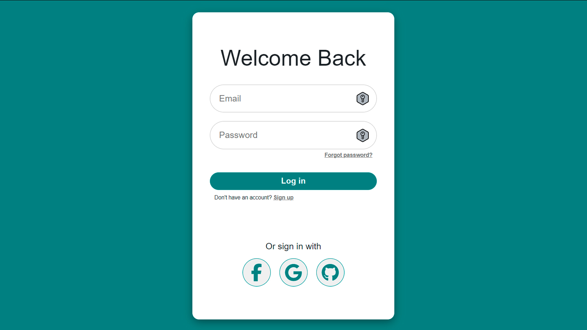

# User Authentication System

## Deploy GitHub-Page
https://pepaxd.github.io/authenticationUser

This project is a user authentication system implemented in a web application using technologies such as HTML, CSS, JavaScript, and Firebase for authentication management.

## Description
The main goal of this project is to provide users with the ability to register, log in, and authenticate securely within the application. 
It utilizes Firebase Authentication to manage various authentication methods, including email and password, Google, Facebook, GitHub, among others.

## Key Features
- **User Registration**: Allows users to create new accounts by providing basic information such as email, name, password, etc.
- **Login**: Enables users to sign in using different authentication methods, including email and password, Google, Facebook, GitHub, etc.
- **Social Media Authentication**: Allows users to authenticate using their social media accounts like Google, Facebook, and GitHub.
- **Attractive User Interface**: User-friendly and responsive design for an enjoyable user experience.

## Project Structure
- **HTML/CSS/JavaScript**: Files handling the user interface and client-side logic.
- **Firebase Configuration**: Project configuration in Firebase for authentication management.
- **Firebase Functions (if applicable)**: Possible implementation of cloud functions for additional management.

- ## Website Structure
1. `index.html`: loginUser.
2. `signUp.html`: addUser to dataBase.
3. `userValidated.html`: "User login/added to the database.".
4. `/styles` directoryStyle SCSS.
5. `/app` files.js.
6. `/img` logoWeb.

## Installation and Usage
1. Clone the repository.
2. Configure your project in Firebase and update the credentials in the corresponding code.
3. Open the project in your browser or local server to test the functionality.

## Contribution
If you wish to contribute to the project, follow these steps:
- Fork the repository.
- Make your changes or improvements in a separate branch.
- Submit a pull request detailing your modifications.

## User Security
It's important to note that while this project implements various authentication methods, it's for educational purposes and aimed at strengthening knowledge regarding authentication processes and best practices.

**Note**: Although efforts are made to maintain security best practices, it's advisable not to use real or sensitive information in this project as it's meant for educational purposes only.

### Educational Intent
This project serves as an educational tool to reinforce understanding and best practices in user authentication. It is not intended for production use but rather for learning, experimentation, and skill enhancement in the domain of user authentication and security practices.

## Author
- **Mauro Pepa**: [GitHub Profile](https://github.com/PEPAXD)

## License
This project is licensed under the MIT License. See the LICENSE.md file for more deta

---
Thank you for using authenticationUser!

